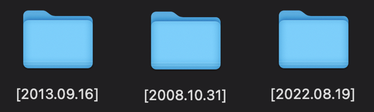

This project aims to help organize images and photos for backups.
It handles folders like below...

...and delivers the files in dated folders:

This allows the user to organize their backup of memories still assigning the themes to the respective folders:

## 💻 Technologies used

- [Python](https://www.python.org/) in code.
- [Pytest](https://docs.pytest.org/en/7.1.x/) for tests.
- [Poetry](https://python-poetry.org/) for package manager.

## ✋🏻 Prerequisite

To execute this project you will need to have the following components in your environment.

- Your **Python** must be version 3.7 or higher
- It is necessary to have the **Poetry** for sending commands to the application.
  The [installation process]( https://python-poetry.org/docs/#installation) is described on the official site.

## 👨‍💻 Running the application

The project is based on a script, so, all the flow will happen in your terminal.

All the commands in this documentation need to be sent with the terminal running at the project root path.

### Dependencies

Your first execution of the application will need to get the project dependencies. If you desire only to use the
features use the command `poetry install --only main`, but if you want to use the project as a developer use the
command `poetry install`

### Starting

For the application start to organize your photos and videos use the command `poetry run poe start Path` and replace
the `Path` for the path to the files that you want to be organized.

By default, the application will keep the files at the source and will only copy them to the created folders. If you want the process not kept files in the root folder, use the `-m` or `--move_files` operator, as shown in the examples below:

    poetry run poe -m Path

or

    poetry run poe --move_files Path

## 📝 Tests

Pointing to the project's root folder with your terminal and the prerequisites concluded, you may use the command below:

    poetry run poe test

All tests (Files with names beginning with `test_`) will be run automatically and the results will be displayed on the
terminal.